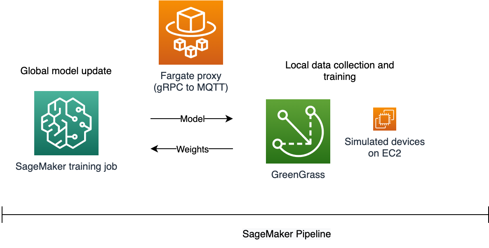
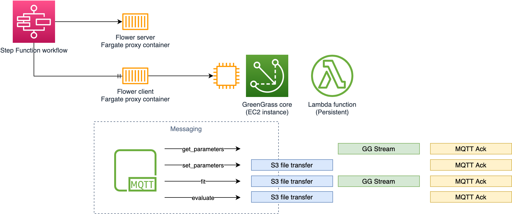
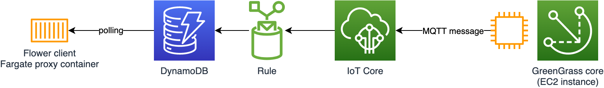
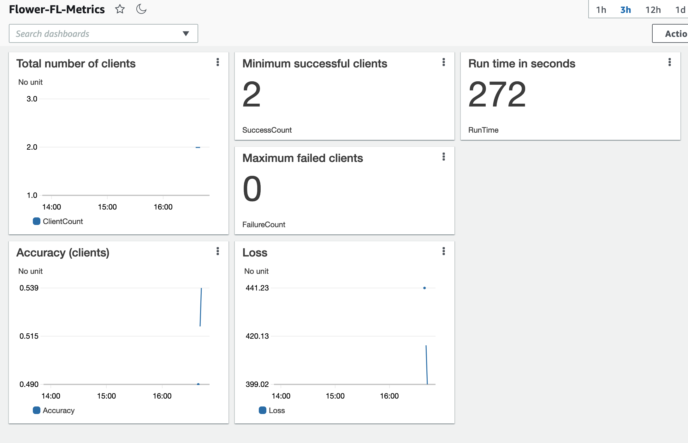

# Federated Learning using AWS IoT 

Federated learning (FL) is a machine learning (ML) scenario with two distinct characteristics.  First, training occurs on multiple machines.  Second, each machine involved in training keeps training data locally; the only information shared between machines is the ML model and its parameters.  FL solves challenges related to data privacy and scalability in scenarios such as mobile devices and IoT.

## Considerations for federated learning

Compared to traditional ML workflows, FL poses two challenges.

* Training cluster unpredictability.  There are mature methods for distributed training using multiple machines.  In the case of FL, however, we may have a very large number of training machines that each has a small segment of the overall data set, and these machines may not be online all the time.  Think of mobile devices or a fleet of industrial monitoring equipment.
* ML framework.  While most popular ML frameworks like TensorFlow and PyTorch support distributed training, FL poses new challenges.  In particular, the training coordinator may not itself see any of the data, and it has to somehow combine the training results from multiple other machines.  

There are a new class of FL frameworks that attempt to handle some of these challenges.  TensorFlow Federated (TFF) handles data sharding between training machines and result aggregation, but it is only intended for simulations.  PyTorch Mobile intends to address FL in the future.  PySyft is another emerging framework for FL.

## Design choices

In order to overcome the two challenges noted above, I decided to use IoT devices and the [Flower](https://flower.dev/) FL framework.  IoT devices are somewhat easier to simulate for demonstration purposes, and the AWS IoT services provide mature capabilities for handling intermittent connectivity and pushing large amounts of data to and from devices.

The Flower framework supports both TensorFlow and PyTorch, and has a well-defined separation of duties between the training coordinator and the training machines.

## Architecture

Conceptually, our architecture might look like this.

A pipeline or workflow coordinator kicks off an FL job.  We simulate IoT devices using EC2 instances running the GreenGrass Core.  Because Flower uses gRPC for communication between the training coordinator and the training machines, we use a container as a proxy in between the coordinator and the IoT devices.

At the next level down, we can use a Step Functions workflow to coordinate this process.  It'll launch one container to run the training coordinator, and one more container for each IoT device.  The GreenGrass instances will run a persistent Lambda function that is ready to respond to requests from the proxy.

Looking at the methods that a Flower training machine has to implement, they require passing in a potentially large `parameters` object (the model weights), and returning updated `parameters` as well as other data.  The `parameters` may be too large to pass directly as MQTT payloads.  We will use GreenGrass Streams to let the IoT devices send large objects back to S3, and the deviceds will directly download from S3 when they need to get updated `parameters`.  

Since the Flower FL paradigm is synchronous, we need to emulate that behavior between the proxies and the devices.  The proxies can send commands as MQTT messages.  The devices will respond to those, and write response messages to other topics.  The IoT rules engine will relay those response messages into a DynamoDB table, and the proxies will poll for response updates.

### MQTT topics

Here are the MQTT topics we use currently.

* flower/clients/<client id> for heartbeats
    * Every device sends a message here once a minute
* commands/client/<client id>/update to send commands to the GG core
    * proxy publishes messages here to effectively make a call to the device
    * message will include a `method` parameter and other necessary arguments
    * device subscribes to this topic
* parameters/client/<client id>/sent to send response of `get_parameters`
    * device sends messages here to indicate that it's done with a method
    * message will include return values
    * IoT rule publishes these messages to DynamoDB
    * proxy will poll the table for the message, and then remove it
* set/client/<client id>/sent to send response of `set_parameters`
    * device sends messages here to indicate that it's done with a method
    * message will include return values
    * IoT rule publishes these messages to DynamoDB
    * proxy will poll the table for the message, and then remove it
* fit/client/<client id>/sent to send response of `fit`
    * device sends messages here to indicate that it's done with a method
    * message will include return values
    * IoT rule publishes these messages to DynamoDB
    * proxy will poll the table for the message, and then remove it
* evaluate/client/<client id>/sent to send response of `evaluate`
    * device sends messages here to indicate that it's done with a method
    * message will include return values
    * IoT rule publishes these messages to DynamoDB
    * proxy will poll the table for the message, and then remove it

### DynamoDB

We use one table that has a partition key of `client` and a range key of `type`, which is the type of method the message is for.  The IoT rule inserts the message payload as a JSON document in the `path` column.

### Client discovery

We set up an IoT Analytics flow (channel -> pipeline -> data set) that gives us the ten devices with the most recent heartbeats.

    SELECT DISTINCT client, MAX(time) 
    FROM flower_ds2
    GROUP BY client
    ORDER BY MAX(time), client DESC 
    LIMIT 10

### The ML model

In a real scenario, we'd have to distribute the model artifact to all the devices.  The devices would gather local data for the training process.  For the sake of demonstration, here we're using the canned CIFAR10 model available through PyTorch.

### Security group notes

We create two security groups, one for the GreenGrass cores and another for the ECS tasks, to allow communication inside these groups.  The tasks communicate with each other over port 8080.

In a real deployment, the GreenGrass core has to accept MQTT communication on port 8883 from local devices.  

## Deployment

### Create S3 bucket

In the AWS console, create a new S3 bucket.  Enable versioning and default encryption.
### Build containers

Go into the `containers` directory and build the two images we need.

* Coordinator
    * Go to `containers/coordinator`
    * `../build_and_push.sh flower-coordinator`
* Proxy
    * Go to `containers/proxy`
    * `../build_and_push.sh flower-proxy`

After each build finishes, note the container image URL.  This will look like:

    <account ID>.dkr.ecr.<region>.amazonaws.com/<image name>

### Upload Lambda function

First, create the zip file.

    cd lambda
    zip flower.zip flower.py

Now upload to S3.  You'll need the name of the S3 bucket you created earlier.

    aws s3 cp flower.zip s3://<BUCKET>/lambda/flower.zip

### Deploy starting resources with CloudFormation

* Log in to the AWS console and switch to your desired region
* Verify the [Service-linked role for Amazon ECS](https://docs.aws.amazon.com/AmazonECS/latest/developerguide/using-service-linked-roles.html#create-service-linked-role) exists within your account.
* Go to the CloudFormation console
* Deploy the template `cfn/flower-demo.yaml`.  The default parameters should be fine in most cases.  You will need to provide the name of the S3 bucket you created earlier.

### Finish configuring GreenGrass

Edit the file `scripts/gg_setup.json` and insert the correct values for each item in the dictionary.

* `STACK_NAME` - Provide the name of your Cloudformation Stack
* `DEF_UNIQUE_KEY` - A unique identifier for this environment

Run this python script to finish setting up subscriptions and other resources for GreenGrass.

    cd scripts
    python gg_setup.py

### Deploy IoT rules and analytics

Edit the file `scripts/iot_setup.json` and insert the correct values for each item in the dictionary.

* `STACK_NAME` - Provide the name of your Cloudformation Stack
* `DEF_UNIQUE_KEY` - A unique identifier for this environment
 
Run this python script to finish setting up IoT rules and analytics.

    cd scripts
    python iot_setup.py

### Execute State Machine

Before executing the State Machine:

* The Green Grass Core Lambda functions must complete initialization.  This process typically takes 45-60 minutes.  For details, see cloudwatch logs at: `/aws/greengrass/Lambda/${REGION}/${ACCOUNTID}/${PROJECT_TAG}-FlowerFn`
* IOT Analytics DataSet must run at least once.  By default the dataset runs at the start of every hour.

Once the prerequisites above have been completed: 

* Navigate to the StepFunctions console
* Select the FederatedLearning-StateMachine
* Click the `Start execution` button 
* View the logs of the flower-proxy and flower-coordinator ECS Tasks for results

### View Metrics

Once the state machine has run, create the a set of metrics and a CloudWatch dashboard using the CloudFormation template `cfn/flower-metrics.yaml`.  

This stack creates CloudWatch log metric filters.  We pull six pieces of information out of the log files from the ECS tasks:

* Reported accuracy from the clients
* Reported loss from the clients
* Count of clients used by the coordinator
* Count of successful client responses as seen by the coordinator
* Count of failed client responses as seen by the coordinator
* Overall run time as reported by the coordinator

We also prepared a dashboard called `Flower-FL-Metrics` that shows these data points.

### Clean up

Follow these steps to clean up the resources used in this workshop:

* Execute the iot cleanup script: `python iot_setup.py --clean`
* Execute the greengrass cleanup script: `python gg_setup.py --clean`
* Delete the two CloudFormation templates
* Delete the S3 bucket
* Delete the two container images from ECR

## Security

See [CONTRIBUTING](CONTRIBUTING.md#security-issue-notifications) for more information.

## License

This library is licensed under the MIT-0 License. See the LICENSE file.
